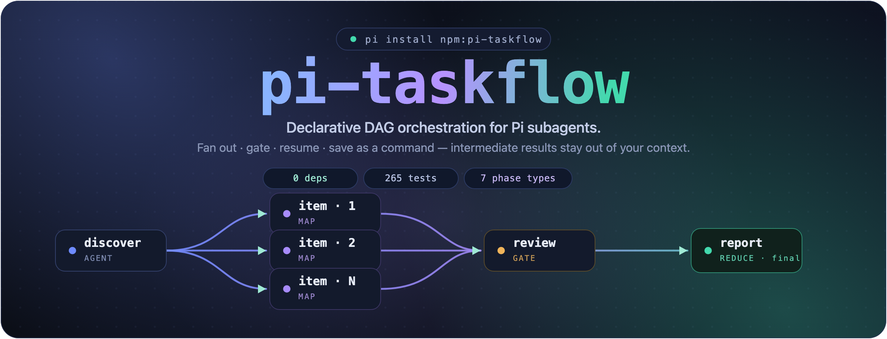

<div align="center">



<p>
  <a href="https://www.npmjs.com/package/pi-taskflow"></a>
  <a href="https://www.npmjs.com/package/pi-taskflow"></a>
  <a href="./LICENSE"></a>
  <a href="#whats-inside"></a>
  <a href="https://github.com/heggria/pi-taskflow/actions/workflows/ci.yml"></a>
  <a href="#whats-inside"></a>
  <a href="#whats-inside"></a>
  <a href="https://pi.dev"></a>
</p>

<p align="center">
  <a href="../README.md">English</a> ·
  <a href="../README.zh-CN.md">简体中文</a> ·
  <b>हिन्दी</b> ·
  <a href="../README.es.md">Español</a> ·
  <a href="../README.ar.md">العربية</a>
</p>

<p><strong><a href="https://pi.dev">Pi</a> सबएजेंटों के लिए डिक्लेरेटिव DAG ऑर्केस्ट्रेशन।</strong><br/>
फैन आउट करें · गेट करें · रिज़्यूम करें · एक कमांड के रूप में सेव करें — इंटरमीडिएट परिणाम आपके कॉन्टेक्स्ट से बाहर रहते हैं।</p>

```bash
pi install npm:pi-taskflow
```

</div>

---

**सबएजेंट फायर-एंड-फॉरगेट हैं। टास्कफ्लो फायर करते हैं, फैन आउट करते हैं, रुकते हैं, गेट करते हैं, रिज़्यूम करते हैं, और खुद को एक कमांड के रूप में सेव कर लेते हैं।**

आप पहले से ही बिल्ट-इन सबएजेंट टूल के `task` / `tasks` / `chain` से परिचित हैं। `pi-taskflow` उसी **शॉर्टहैंड** का उपयोग करता है — ताकि आपके मौजूदा डेलिगेशन तुरंत **ट्रैक किए गए, रिज़्यूमेबल, और एक-शब्द `/tf:<name>` कमांड के रूप में सेव हो जाएं।** जब शॉर्टहैंड पर्याप्त न हो, तो पूरा DSL आपको एक वास्तविक DAG देता है: दर्जनों आइटम पर डायनामिक फैन-आउट, कंडीशनल रूटिंग, क्वालिटी गेट्स, ह्यूमन अप्रूवल, रिट्राइज़, और एक हार्ड स्पेंड सीलिंग।

और पूरे समय, **केवल अंतिम फेज़ आपके कन्वर्सेशन तक पहुंचता है।** हर इंटरमीडिएट ट्रांसक्रिप्ट रनटाइम में रहता है, आपके कॉन्टेक्स्ट विंडो में कभी नहीं।

## यह क्यों मौजूद है

यहाँ वह दीवार है जिससे आप रॉ सबएजेंट के साथ टकराते हैं: आप एक मल्टी-स्टेप प्लान गद्य में बताते हैं, मॉडल हर रन पर उसे फिर से निकालता है, इंटरमीडिएट ट्रांसक्रिप्ट आपके कॉन्टेक्स्ट में बाढ़ ला देते हैं, और जैसे ही एक मॉडल कॉल फेल होती है आप शून्य से शुरू करते हैं। कोई रीयूज़ नहीं, कोई रिकवरी नहीं, कोई संरचना नहीं।

`pi-taskflow` प्लान को **प्रॉम्प्ट से बाहर और एक डिक्लेरेटिव डेफ़िनिशन में ले जाता है।** रनटाइम DAG, लूप, रिट्राइज़ और इंटरमीडिएट स्टेट का मालिक होता है। आप एक पाइपलाइन को एक बार डिक्लेयर करते हैं और उसे सौ बार चलाते हैं — नाम से।

<div align="center">

</div>

> जब किसी कार्य में ब्रांचिंग फैन-आउट और एक रिव्यू गेट के साथ बारह चरणों की आवश्यकता हो, तो आपको ऑर्केस्ट्रेशन चाहिए — न कि भाग्यशाली प्रॉम्प्टिंग।

| | सबएजेंट (बिल्ट-इन) | **pi-taskflow** |
|---|---|---|
| **नियंत्रण किसके पास** | मॉडल, बारी-बारी से | रनटाइम, एक डेफ़िनिशन से |
| **टोपोलॉजी** | चेन / फ्लैट पैरेलल | **लेयर्ड कन्करेंसी + रूटिंग के साथ DAG** |
| **इंटरमीडिएट परिणाम** | आपके कॉन्टेक्स्ट विंडो में | **रनटाइम में — आपके कॉन्टेक्स्ट में नहीं** |
| **स्केल** | मुट्ठी भर टास्क | **डायनामिक `map` फैन-आउट दर्जनों आइटम पर** |
| **पुन: प्रयोज्य** | हर बार फिर से वर्णित | **`/tf:<name>` के रूप में सेव** |
| **रिज़्यूमेबल** | ✗ | **✓ क्रॉस-सेशन — कैश्ड फेज़ ऑटो-स्किप** |
| **क्वालिटी गेट्स** | ✗ | **`gate` फेज़ जो `VERDICT: BLOCK` पर रुक जाते हैं** |
| **कंडीशनल रूटिंग** | ✗ | **`when` गार्ड + `join: any` OR-जॉइन** |
| **फॉल्ट टॉलरेंस** | ✗ | **प्रति-फेज़ `retry` + क्षणिक त्रुटियों पर ऑटो-रिट्राइ** |
| **ह्यूमन-इन-द-लूप** | ✗ | **`approval` फेज़ (अप्रूव / रिजेक्ट / एडिट)** |
| **लागत नियंत्रण** | ✗ | **रन-वाइड `budget` (USD / टोकन कैप)** |
| **कम्पोज़िशन** | ✗ | **`flow` फेज़ सेव किए गए सब-फ्लो चलाते हैं** |
| **लाइव प्रोग्रेस** | चलते समय अपारदर्शी | **लाइव DAG रेंडर टाइमिंग + लागत के साथ** |
| **एर्गोनॉमिक्स** | हर बार इनलाइन JSON | **शॉर्टहैंड (`task`/`tasks`/`chain`) *या* DSL** |

यह सबएजेंट टूल को रिप्लेस नहीं करता। यह आपके सबएजेंट को एक DAG, एक मेमोरी और एक नाम देता है।

> 📖 पूरी तुलना — सभी Pi एक्सटेंशन के साथ — के लिए [English README](../README.md#compared-to-other-pi-extensions) देखें।

## 30 सेकंड में शुरुआत

**1. इंस्टॉल करें** — एक कमांड:

```bash
pi install npm:pi-taskflow
```

> **वैकल्पिक:** एक बार `/tf init` चलाकर 18 बिल्ट-इन एजेंटों के मॉडल रोल्स
> (`fast`, `strong`, `thinker`, …) को अपने मॉडल से मैप करें — एक इंटरैक्टिव पिकर।
> इसे छोड़ें और एजेंट बस Pi के डिफ़ॉल्ट मॉडल का उपयोग करेंगे।

**2. चलाएं** — बस Pi सेशन में मॉडल से कहें:

> *एक चेन चलाओ: पहले auth फ्लो को एक्सप्लोर करो, फिर निष्कर्षों का सारांश बनाओ।*

मॉडल अपने आप `taskflow` टूल को कॉल करता है। आपको लाइव प्रोग्रेस, प्रति-स्टेप टाइमिंग, टोकन लागत और एक सेव किया गया रन रिकॉर्ड मिलता है — **बिल्ट-इन टूल जितनी ही मेहनत, अब ट्रैक्ड और रिज़्यूमेबल।**

**3. सेव करें** — कहें *"save it"* और आपके पास `/tf:<name>` हमेशा के लिए है।

बस इतना ही। आप अपनी कॉफी ठंडी होने से पहले अपना पहला वर्कफ्लो चला सकते हैं — बिना एक भी फेज़ डेफ़िनिशन लिखे।

> 📖 शॉर्टहैंड उदाहरण, डीप डायग्राम रन, DSL, फेज़ टाइप्स, इंटरपोलेशन, कमांड्स, रिज़्यूम, स्टोरेज, एजेंट्स और मॉडल रोल्स के लिए कृपया [English README](../README.md) देखें।

## क्या अंदर है

<div align="center">

**0 रनटाइम निर्भरताएं** · **394 टेस्ट** · **10 फेज़ टाइप्स** · **क्रॉस-सेशन रिज़्यूम** · **क्रॉस-रन मेमोइज़ेशन** · **~4.9k LOC रनटाइम**

</div>

## 🍽️ हम अपना ही Dog Food खाते हैं

`pi-taskflow` की हर सुविधा **`pi-taskflow` के माध्यम से** शिप होती है।

हमारा `self-improve` फ्लो एक 10-फेज़ DAG है — यह कोडबेस का ऑडिट करता है, दोषों को पैच करता है, शुद्धता की पुष्टि करता है, क्वालिटी पर गेट करता है, और रिपोर्ट सामने लाता है — यह सब डिक्लेरेटिव तरीके से। यह `/tf:self-improve` के रूप में सेव है और हर रिलीज़ से पहले चलाया जाता है। Pi इकोसिस्टम में कोई अन्य एजेंट ऑर्केस्ट्रेटर खुद को खुद से नहीं बनाता।

| अभियान | पैमाना | फेज़ | परिणाम |
|----------|-------|--------|---------|
| [v0.0.8 dogfood](./docs/dogfooding-v0.0.8-report.md) | पूर्ण कोडबेस ऑडिट → ट्रायेज → फिक्स → वेरिफाई | 10 फेज़, 234 टेस्ट | 13 फिक्स, सभी पास |
| [v0.0.6 सेल्फ-ऑडिट](./docs/self-audit-report.md) | इन्वेंट्री → मैप ऑडिट → गेट → अप्रूवल → मैप फिक्स → रिड्यूस | 9 फेज़ | 11 क्रिटिकल दोष ठीक हुए |
| [क्रॉस-रन कैश dogfood](./docs/rfc-cross-run-memoization.md) | वास्तविक रनटाइम + ऑन-डिस्क स्टोर | समर्पित टेस्ट हार्नेस | विरोधी फिंगरप्रिंट के तहत कैश शुद्धता |
| [एडवरसीरियल क्रॉस-रिव्यू](./docs/brainstorm-adversarial-review-report.md) | मल्टी-एजेंट विरोधी समीक्षा | `tournament` + `gate` | P0 कैश-कुंजी फिक्स शिप हुआ |
| [Init रीडिज़ाइन रिव्यू](./docs/issue-necessity-review-report.md) | आवश्यकता ऑडिट → पैरेलल चेक → वर्डिक्ट | 7 फेज़ | पूर्ण रीडिज़ाइन प्लान मान्य हुआ |

> **मेटा:** हमने `pi-taskflow`'s `map` फैन-आउट, `gate` वर्डिक्ट, `approval` ह्यूमन-इन-द-लूप, `tournament` बेस्ट-ऑफ़-एन, `loop` अनटिल-डन, और `cross-run` कैश का उपयोग किया — `pi-taskflow` बनाने के लिए।

---

> 📖 पूर्ण दस्तावेज़ — फेज़ टाइप्स, DSL, इंटरपोलेशन, कमांड्स, एजेंट्स, मॉडल रोल्स, स्टेटस और सीमाएं, डेवलपमेंट और योगदान दिशानिर्देश — के लिए कृपया [English README](../README.md) देखें।

---

अगर इससे आपका एक कॉन्टेक्स्ट विंडो बचता है, तो GitHub पर एक ⭐ ड्रॉप करें — यह वास्तव में मदद करता है।
